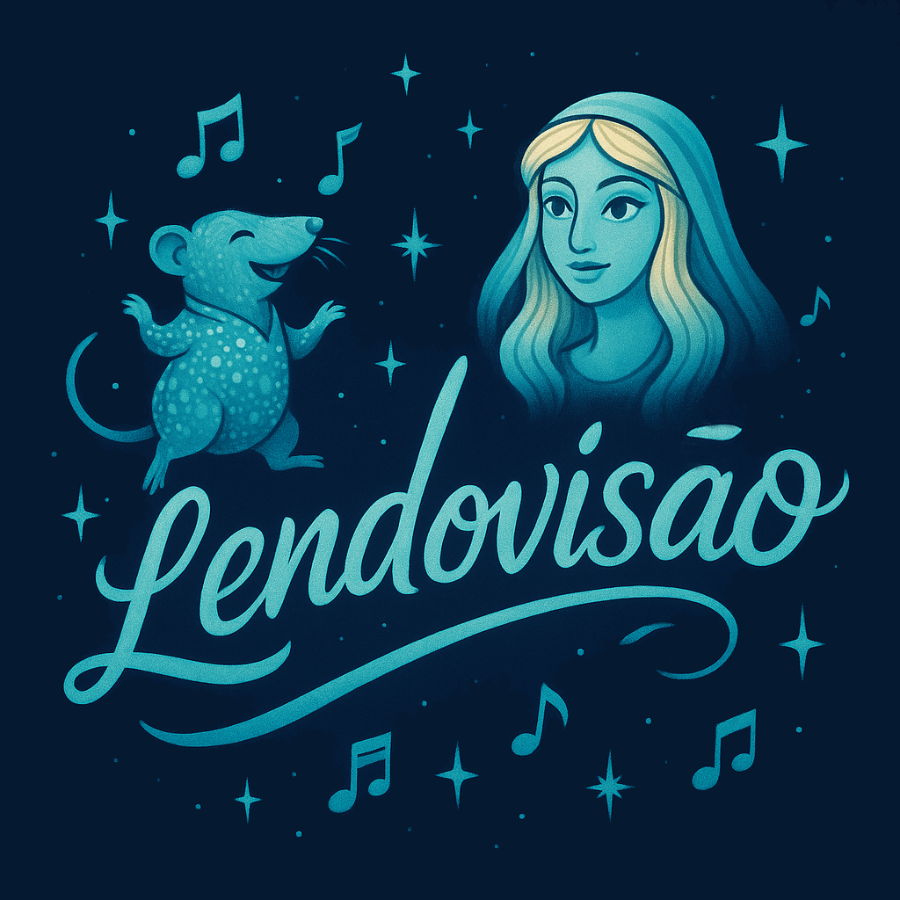
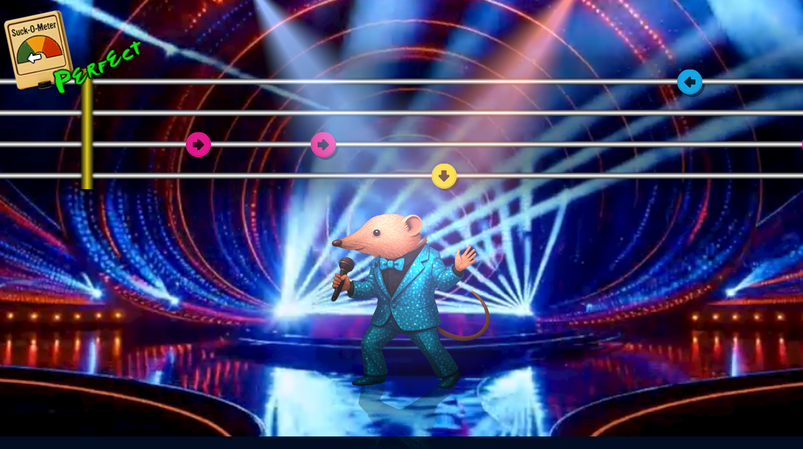
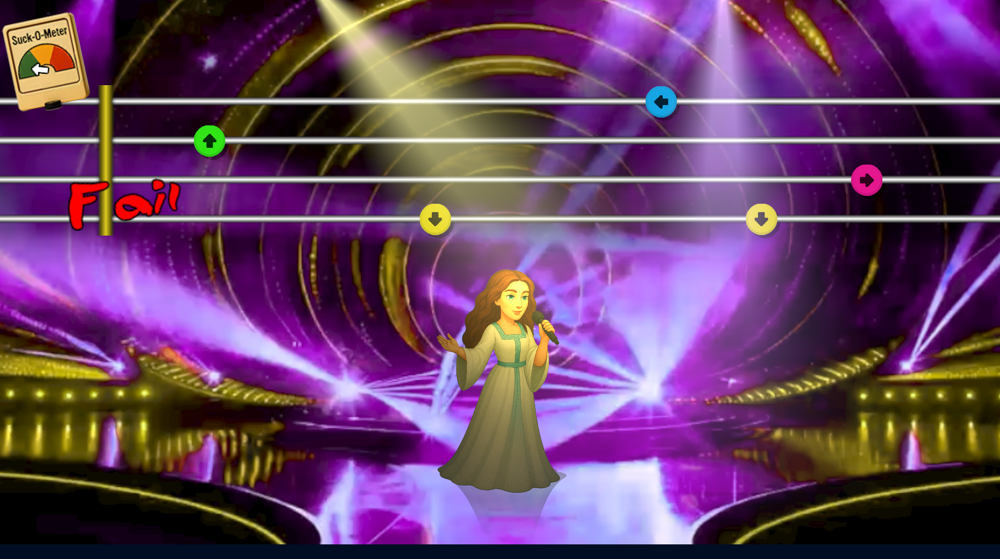

# LENDOVISÃO

Developed for the 4th [EPIC-WE] cultural game jam in Óbidos, with theme "Legends",.
I was one of the people that were helping out with the more technical aspects of game development, but being surrounded with criativity, I decided to do this game in about a day, honoring the Eurovision sound contest, one of the most european things in existence!
Afterwards, since I needed a game for the May'25 [Game Creator's Club], I decided to add an extra character to fit with the theme: "Plant".

## Game

This is a rhythm game in which you have to finish you performance to score points.
As usual in this sort of thing, you have to match the cursor keys (or WASD, ifyou prefer) to the notes being played.
The songs are in portuguese, and each of them cover a specific myth in the Portuguese folklore.

## Art

- [1-Bit Pack by Kenney](hhttps://kenney.nl/assets/1-bit-pack) by [Kenney](https://kenney.nl), licensed through the [CC0] license.
- Font [David Eurofan Eurovision](https://www.dafont.com/david-eurofan-eurovision.font) by [David Eurofan](https://www.dafont.com/david-eurofan.d4762), free for non-commercial use.
- Characters and logo generated by AI (DallE)
- Background video generated by AI (Sora)
- Everything else done by [Diogo de Andrade], licensed through the [CC0] license.

## Sound

- [Booing sound]https://freesound.org/people/mrrap4food/sounds/619042/) by [mrrap4food](https://freesound.org/people/mrrap4food/), [CC0] license.
- Music AI generated with [Suno]
- Everything else done by [Diogo de Andrade], licensed through the [CC0] license.

## Code

- Some code was adapted/refactored from [Okapi Kit], [MIT] license.
- Uses [Unity Common], [MIT] license.
- All remaining game source code by Diogo de Andrade is licensed under the [MIT] license.

## Metadata

- Autor: [Diogo de Andrade]

[Diogo de Andrade]:https://github.com/DiogoDeAndrade
[CC0]:https://creativecommons.org/publicdomain/zero/1.0/
[CC-BY 3.0]:https://creativecommons.org/licenses/by/3.0/
[CC-BY-NC 3.0]:https://creativecommons.org/licenses/by-nc/3.0/
[CC-BY-SA 4.0]:http://creativecommons.org/licenses/by-sa/4.0/
[CC-BY 4.0]:https://creativecommons.org/licenses/by/4.0/
[CC-BY-NC 4.0]:https://creativecommons.org/licenses/by-nc/4.0/
[OkapiKit]:https://github.com/VideojogosLusofona/OkapiKit
[Unity Common]:https://github.com/DiogoDeAndrade/UnityCommon
[Suno]:https://suno.com/
[EPIC-WE]:https://epic-we.eu/
[Game Creator's Club]:https://game-creators-club.itch.io/
[MIT]:LICENSE
